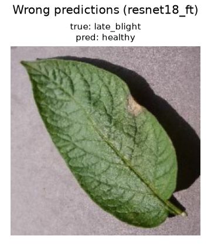

# Plant Disease Classification with a CNN

A PyTorch project that classifies potato leaf images into three classes:

- `healthy`
- `early_blight`
- `late_blight`

This is an end-to-end learning project covering data preparation, model design, training, evaluation, and inference. It compares three models:

- **`cnn`**: a small CNN built from scratch (three convolutional blocks), so every layer and tensor shape can be followed and understood.
- **`resnet18`**: transfer learning from an ImageNet-pretrained ResNet18 with the backbone frozen. Only a new final layer is trained.
- **`resnet18_ft`**: the same pretrained ResNet18, fine-tuned end to end with a small learning rate on the pretrained layers.

## Results

All three models were evaluated on the same held-out test set: 69 images that were not used for training or for picking the best checkpoint.

| Metric                    | `cnn`         | `resnet18` (frozen) | `resnet18_ft` (fine-tuned) |
|---------------------------|---------------|---------------------|----------------------------|
| Test accuracy             | 97.1% (67/69) | 97.1% (67/69)       | **98.6% (68/69)**          |
| `late_blight` recall      | 0.957         | 0.913               | 0.957                      |
| Diseased → `healthy`      | 1             | 1                   | 1                          |
| `healthy` → diseased      | 1             | 0                   | 0                          |
| Wrong disease             | 0             | 1                   | 0                          |
| Best epoch (of 15)        | 8             | 14                  | 14                         |
| Trainable parameters      | 2,121,475     | 1,539               | 11,178,051                 |
| Training time (CPU)       | 72 s          | 218 s               | 371 s                      |

"Diseased → `healthy`" is a missed infection, the costliest error. "`healthy` → diseased" is a false alarm.

**Takeaways:**

- **Fine-tuning is the best model in both runs** (see the next section) and the most confident on hard cases. On `samples/late_blight.jpg`, a leaf with one small lesion, `resnet18_ft` predicts `late_blight` with 99.8% confidence, `resnet18` with 72.8%, and `cnn` gets it wrong (56.7% `healthy`).
- **`cnn` and frozen `resnet18` are tied.** Their differences are within the run-to-run noise described below.
- **The hardest leaves are early-stage `late_blight` with small lesions.** Each model misses exactly one infection, and in every case it is a `late_blight` leaf that is still mostly green.

### Run-to-run variation

Training is not seeded, and the whole project was trained twice. Between the two runs, the checkpoint selection rule also changed from "first epoch with the highest validation accuracy" to "highest validation accuracy, ties broken by lower validation loss".

| Model         | Run 1 test accuracy | Run 2 test accuracy (reported above) |
|---------------|---------------------|--------------------------------------|
| `cnn`         | 95.7%               | 97.1%                                |
| `resnet18`    | 95.7%               | 97.1%                                |
| `resnet18_ft` | 97.1%               | 98.6%                                |

In run 1, `cnn` missed 3 `late_blight` leaves while frozen `resnet18` missed only 1. In run 2 both missed 1. With only 69 test images, one image is worth about 1.5 percentage points, so conclusions drawn from a single run are fragile. The only result that held in both runs is that `resnet18_ft` scored highest.

### `cnn`


### `resnet18` (frozen)


### `resnet18_ft` (fine-tuned)


The only error is a `late_blight` leaf with a single small lesion near the edge:



Correct predictions from each model are saved in `results/<model>/correct_examples.png`.

## Dataset

A small, balanced sample of the [PlantVillage dataset](https://github.com/spMohanty/PlantVillage-Dataset) (color images, 256×256):

| Class        | Source folder           | Images |
|--------------|-------------------------|--------|
| healthy      | `Potato___healthy`      | 150    |
| early_blight | `Potato___Early_blight` | 150    |
| late_blight  | `Potato___Late_blight`  | 150    |

Each class is split separately into 70% train, 15% validation, and 15% test (105 / 22 / 23 images per class). The split uses a fixed random seed, so it is reproducible.

## Models

### `cnn` (from scratch)

```
Input: 3 × 128 × 128
Conv(3→16)  + BatchNorm + ReLU + MaxPool  →  16 × 64 × 64
Conv(16→32) + BatchNorm + ReLU + MaxPool  →  32 × 32 × 32
Conv(32→64) + BatchNorm + ReLU + MaxPool  →  64 × 16 × 16
Flatten → Linear(16384 → 128) + ReLU + Dropout(0.3)
Linear(128 → 3)
```

Inputs are normalized with a mean and std of 0.5 per channel. Learning rate: 1e-3.

### `resnet18` (frozen backbone)

- ResNet18 with ImageNet weights (`IMAGENET1K_V1`) from torchvision.
- All pretrained layers are frozen (`requires_grad = False`).
- The final 1000-class layer is replaced by `Linear(512 → 3)`, which is the only part that is trained. Learning rate: 1e-3.

### `resnet18_ft` (fine-tuned)

- Same starting point as `resnet18`, but all layers are trainable.
- Two learning rates: 1e-4 for the pretrained layers, so updates don't overwrite what they learned on ImageNet, and 1e-3 for the new final layer, which starts from random weights.

Both ResNet models resize inputs to 224×224 and normalize them with the ImageNet mean and std, matching the preprocessing used during pretraining.

### Training setup (all models)

- Loss: `CrossEntropyLoss`
- Optimizer: Adam
- 15 epochs, batch size 32
- Augmentation (training set only): random horizontal flip and random rotation of up to 15°
- Checkpoint selection: the epoch with the highest validation accuracy, with ties broken by the lower validation loss. The tie-break matters for `resnet18_ft`, which reaches 100% validation accuracy from epoch 2 onward, so accuracy alone cannot rank those epochs.

## Project structure

```
├── scripts/
│   ├── download_data.py   # download the PlantVillage sample into data/raw/
│   └── split_data.py      # split data/raw/ into data/train, data/val, data/test
├── dataset.py             # per-model transforms and DataLoaders
├── model.py               # small CNN and pretrained ResNet18 (frozen or fine-tuned)
├── train.py               # training loop, saves best_<model>.pth
├── evaluate.py            # test-set metrics and plots, saved to results/<model>/
├── predict.py             # predict the class of a single image
├── samples/               # one unseen image per class for quick testing
├── results/
│   ├── cnn/
│   ├── resnet18/
│   └── resnet18_ft/
└── requirements.txt
```

`data/` and the `best_<model>.pth` checkpoints are not tracked in git. Running the steps below regenerates them.

## How to run

Requires Python 3.11. The commands below are for Windows; on macOS or Linux, activate the environment with `source .venv/bin/activate`.

```bash
python -m venv .venv
.venv\Scripts\activate
pip install -r requirements.txt

python scripts/download_data.py   # about 450 images
python scripts/split_data.py
```

Every script accepts `--model cnn` (the default), `--model resnet18`, or `--model resnet18_ft`:

```bash
python train.py --model resnet18_ft
python evaluate.py --model resnet18_ft
python predict.py --model resnet18_ft samples/late_blight.jpg
```

The first ResNet run downloads the pretrained weights (about 45 MB) from download.pytorch.org.

Example of `predict.py` on `samples/late_blight.jpg`:

```
model: resnet18_ft
image: late_blight.jpg
prediction: late_blight (99.8% confidence)

  late_blight    99.8%
  healthy        0.2%
  early_blight   0.0%
```

## Limitations

- **Small dataset.** There are only 105 training images per class. The test set has 69 images, so each test image changes accuracy by about 1.5 percentage points, and model rankings can change between runs.
- **Validation set too small to rank the best models.** `resnet18_ft` reaches 100% validation accuracy (66/66) after two epochs, so accuracy alone stops distinguishing checkpoints.
- **Lab conditions.** All PlantVillage images have a plain background and controlled lighting. Performance on real field photos (soil, other leaves, shadows) is expected to be noticeably worse because of domain shift.
- **Frozen BatchNorm statistics.** In `resnet18`, the frozen layers are not trained, but their BatchNorm running statistics still update in training mode.

## Possible improvements

- Seed training and average results over several runs (or use k-fold cross-validation) so comparisons are not decided by one or two images.
- Use more data, especially early-stage `late_blight` examples, and a larger validation set.
- Flag low-confidence predictions (for example below 80%) for manual review instead of returning a hard label.
- Test on real field photos to measure the effect of domain shift.
