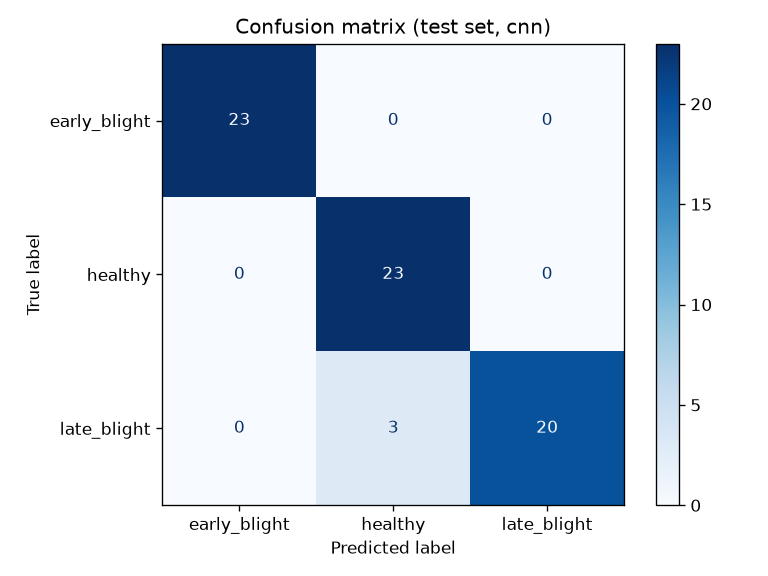
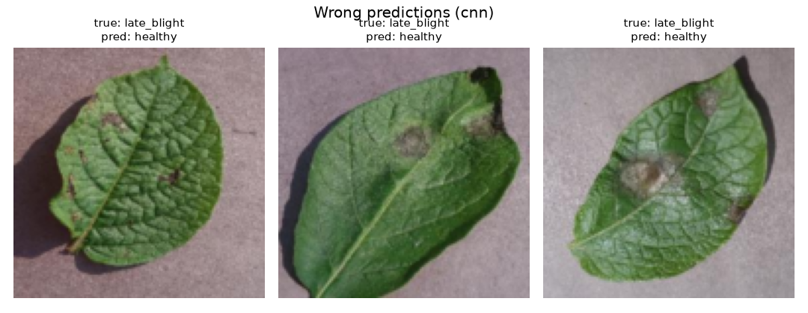
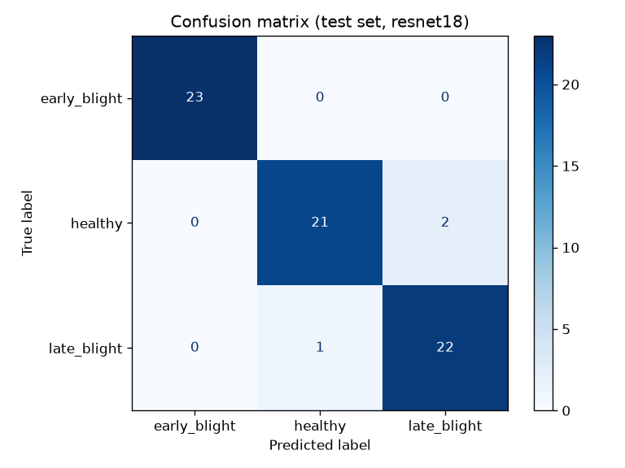
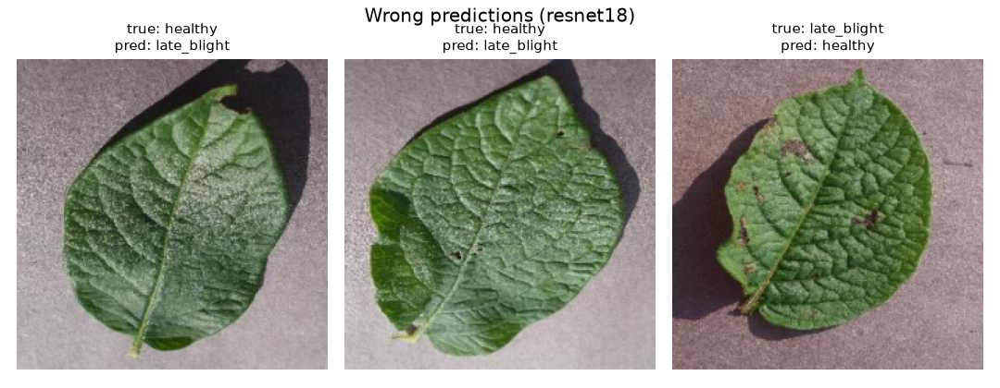
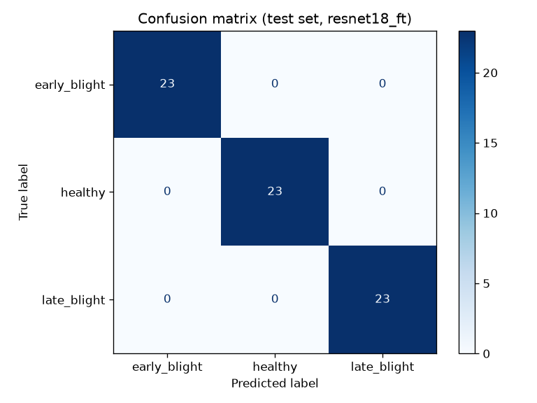
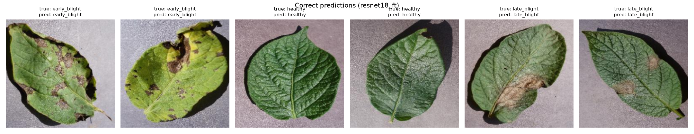
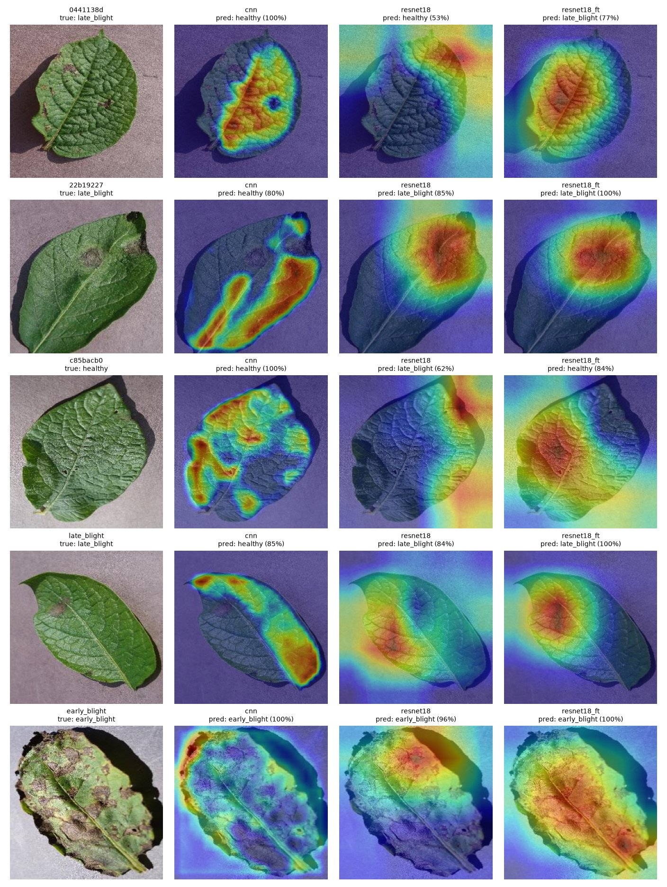
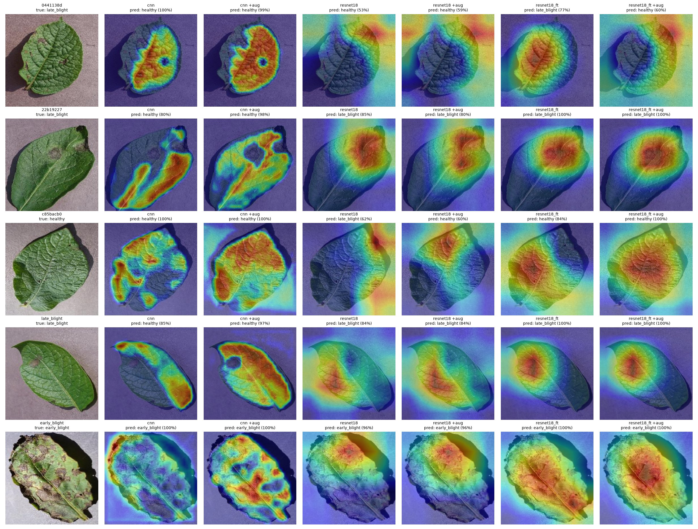

# Plant Disease Classification with a CNN

A PyTorch project that classifies potato leaf images into three classes:

- `healthy`
- `early_blight`
- `late_blight`

This is an end-to-end learning project covering data preparation, model design, training, evaluation, and inference. It compares three models:

- **`cnn`**: a small CNN built from scratch (three convolutional blocks), so every layer and tensor shape can be followed and understood.
- **`resnet18`**: transfer learning from an ImageNet-pretrained ResNet18 with the backbone frozen. Only a new final layer is trained.
- **`resnet18_ft`**: the same pretrained ResNet18, fine-tuned end to end with a small learning rate on the pretrained layers.

## Results

Each model was trained with 3 random seeds (0, 1, 2) and evaluated on the same held-out test set: 69 images that were not used for training or for picking the best checkpoint. The table shows mean ± standard deviation across seeds. The per-seed counts are in parentheses.

| Model | Test accuracy | `late_blight` recall | Missed infections | False alarms |
|---|---|---|---|---|
| `cnn` | 97.1% ± 0.0 | 0.913 ± 0.000 | 2.0 (2, 2, 2) | 0.0 (0, 0, 0) |
| `resnet18` (frozen) | 96.6% ± 0.8 | 0.971 ± 0.025 | 0.7 (1, 0, 1) | 1.7 (2, 2, 1) |
| `resnet18_ft` (fine-tuned) | **99.5% ± 0.8** | **0.986 ± 0.025** | **0.3 (0, 0, 1)** | **0.0 (0, 0, 0)** |

A missed infection is a diseased leaf predicted as `healthy`, which is the costliest error. A false alarm is a `healthy` leaf predicted as diseased. Per-run numbers are in [`results/experiments.csv`](results/experiments.csv), produced by `experiments.py`.

|                        | `cnn`     | `resnet18` | `resnet18_ft` |
|------------------------|-----------|------------|---------------|
| Trainable parameters   | 2,121,475 | 1,539      | 11,178,051    |
| Training time per seed (CPU) | ~1.5 min | ~3.5 min | ~6 min |

**Takeaways:**

- **Fine-tuning wins clearly.** `resnet18_ft` scored 100% on two of three seeds and 98.6% on the third. Its worst seed is still better than the other models' average.
- **`cnn` and frozen `resnet18` have similar accuracy but opposite error profiles.** `cnn` never raises a false alarm but misses the same two `late_blight` leaves on every seed. Frozen `resnet18` misses fewer infections but flags one or two healthy leaves as diseased on every seed. For disease detection, the frozen ResNet's trade-off is usually preferable.
- **The errors are tied to specific images, not luck.** `cnn` gets exactly the same two leaves wrong with all three seeds, even though the training curves differ. Frozen `resnet18` flags the same bright, rough-textured healthy leaf on all three seeds.

### Why multiple seeds

Before seeding was added, the project was trained twice without a seed. The rankings changed between those runs: in one run `cnn` missed 3 infections and frozen `resnet18` missed 1, and in the other run both missed 1. With 69 test images, one image is worth about 1.5 percentage points, so a single run cannot separate models that differ by one or two images. Seeding makes each run reproducible (training twice with the same seed gives identical results, epoch by epoch), and averaging over seeds shows how much of a difference is real.

### Plots (seed 0)

The plots below come from the seed-0 checkpoints, which is what `python train.py --model <name>` reproduces by default.

**`cnn`**: both misses are `late_blight` leaves that are still mostly green, with small or pale lesions.




**`resnet18` (frozen)**: two false alarms on healthy leaves with a bright, rough surface texture, plus one missed early-stage infection.




**`resnet18_ft` (fine-tuned)**: no errors with seed 0.




Correct predictions for the other models are saved in `results/<model>/correct_examples.png`.

## Where the models look (Grad-CAM)

[Grad-CAM](https://arxiv.org/abs/1610.02391) highlights the image regions that pushed a model toward its predicted class. It weights the feature maps of the last convolutional layer by the gradient of the predicted class score, then upsamples the result onto the image. Red means strong evidence for the prediction shown above each panel. `gradcam.py` implements this from scratch with forward and backward hooks and uses the seed-0 checkpoints.



The rows are the hardest images from the multi-seed experiments, plus an easy `early_blight` leaf for reference. What the maps show:

- **`cnn` misses infections because it ignores the lesion.** In rows 1, 2, and 4, the true class is `late_blight`, and `cnn` predicts `healthy` from the green tissue while the lesions sit in cold regions. This fits the earlier guess that it relies on how much of the leaf is green rather than on lesion shape.
- **The pretrained models find the lesion.** In rows 2 and 4, both ResNet models put their hottest region right on the pale lesion. This matches their higher `late_blight` recall.
- **Frozen `resnet18` sometimes looks at the background.** Its false alarm on the healthy leaf in row 3, and its miss in row 1, are driven mostly by the gray background and shadow outside the leaf. That is a shortcut, not a leaf feature. After fine-tuning, `resnet18_ft` focuses on the leaf and gets both images right.
- **A correct answer can still rest on weak evidence.** On the easy `early_blight` leaf in row 5, `cnn` is 100% confident, but its heat sits mostly on the leaf border and the background corner instead of on the many lesions.

Caveats: Grad-CAM is an approximation of what drives a prediction, not a full explanation. ResNet maps come from a 7×7 grid, so they are much coarser than the 32×32 `cnn` maps. These are five hand-picked images, so they illustrate the error patterns but do not prove them.

To run it on your own images:

```bash
python gradcam.py path/to/leaf1.jpg path/to/leaf2.jpg
```

## Trying to fix the shortcuts with stronger augmentation

Grad-CAM showed two shortcuts: `cnn` relies on how green the leaf is, and frozen `resnet18` sometimes relies on the background. To break them, I retrained every model with stronger training-time augmentation (`--strong-augment`):

- `RandomResizedCrop` (60–100% of the image), so the amount and position of background change in every epoch
- `ColorJitter` (brightness, contrast, and saturation ±30%, hue ±0.03), so the intensity of green and the background tone change. Hue is kept small because yellowing is a real `early_blight` symptom.
- Vertical flips and rotation of up to 30° (instead of 15°)

The setup is otherwise the same: 3 seeds and the same test set.

| Model | Basic augmentation | Strong augmentation | Missed infections (basic → strong) | False alarms (basic → strong) |
|---|---|---|---|---|
| `cnn` | 97.1% ± 0.0 | 89.9% ± 3.8 | 2.0 → **5.3** | 0.0 → 0.0 |
| `resnet18` (frozen) | 96.6% ± 0.8 | 97.6% ± 0.8 | 0.7 → 1.3 | 1.7 → **0.0** |
| `resnet18_ft` | **99.5% ± 0.8** | 97.1% ± 1.4 | 0.3 → 1.7 | 0.0 → 0.0 |

Per-run numbers are in [`results/experiments_aug.csv`](results/experiments_aug.csv).



**Strong augmentation helped only the model whose shortcut it targeted:**

- **Frozen `resnet18`: background false alarms are gone.** False alarms dropped from 2, 2, 1 to 0, 0, 0 across seeds. In row 3, the heatmap moves from the background corner onto the leaf, and the prediction flips to the correct `healthy`. On the other hand, it now misses slightly more infections.
- **`cnn`: worse, and the core shortcut remains.** The model underfits. Its training loss stays around 0.3 after 15 epochs, compared with about 0.05–0.1 before, and validation accuracy swings by up to 30 points between epochs. The augmentation did stop it from looking at the border and background (row 5), but on the missed `late_blight` leaves (rows 2 and 4) it now actively avoids the lesions, which show up as dark holes in the heatmap, and it is even more confident in the wrong answer. The problem is what it learned about lesions, not the framing, and augmentation can't fix that.
- **`resnet18_ft`: slightly worse.** It had no shortcut to remove, so the harder training task only cost accuracy. In row 1, the strong-augmentation version even shifts attention to the background corner and gets the leaf wrong.

**Decision:** the default training keeps basic augmentation, and `resnet18_ft` with basic augmentation remains the best model. Strong augmentation is still available behind a flag. With more epochs it might help `cnn`, but that was not tested.

I also tried to measure the shift numerically, as the share of Grad-CAM heat that falls on the leaf. That required a leaf mask, and simple color-based masks (saturation thresholds, distance from the background color, and a greenness index with Otsu thresholding) were unreliable on this data. Pale lesions and shiny healthy leaves were classified as background, and slightly pink backgrounds were classified as leaf. Rather than report a number built on a broken mask, this comparison stays visual.

## Dataset

A small, balanced sample of the [PlantVillage dataset](https://github.com/spMohanty/PlantVillage-Dataset) (color images, 256×256):

| Class        | Source folder           | Images |
|--------------|-------------------------|--------|
| healthy      | `Potato___healthy`      | 150    |
| early_blight | `Potato___Early_blight` | 150    |
| late_blight  | `Potato___Late_blight`  | 150    |

Each class is split separately into 70% train, 15% validation, and 15% test (105 / 22 / 23 images per class). The split uses a fixed random seed, so it is reproducible.

## Models

### `cnn` (from scratch)

```
Input: 3 × 128 × 128
Conv(3→16)  + BatchNorm + ReLU + MaxPool  →  16 × 64 × 64
Conv(16→32) + BatchNorm + ReLU + MaxPool  →  32 × 32 × 32
Conv(32→64) + BatchNorm + ReLU + MaxPool  →  64 × 16 × 16
Flatten → Linear(16384 → 128) + ReLU + Dropout(0.3)
Linear(128 → 3)
```

Inputs are normalized with a mean and std of 0.5 per channel. Learning rate: 1e-3.

### `resnet18` (frozen backbone)

- ResNet18 with ImageNet weights (`IMAGENET1K_V1`) from torchvision.
- All pretrained layers are frozen (`requires_grad = False`).
- The final 1000-class layer is replaced by `Linear(512 → 3)`, which is the only part that is trained. Learning rate: 1e-3.

### `resnet18_ft` (fine-tuned)

- Same starting point as `resnet18`, but all layers are trainable.
- Two learning rates: 1e-4 for the pretrained layers, so updates don't overwrite what they learned on ImageNet, and 1e-3 for the new final layer, which starts from random weights.

Both ResNet models resize inputs to 224×224 and normalize them with the ImageNet mean and std, matching the preprocessing used during pretraining.

### Training setup (all models)

- Loss: `CrossEntropyLoss`
- Optimizer: Adam
- 15 epochs, batch size 32
- Augmentation (training set only): random horizontal flip and random rotation of up to 15°. The stronger variant is described in the previous section.
- Seeded with `torch.manual_seed` (default seed 0, set with `--seed`). The seed controls weight initialization, shuffling order, and augmentation.
- Checkpoint selection: the epoch with the highest validation accuracy, with ties broken by the lower validation loss. The tie-break matters for `resnet18_ft`, which reaches 100% validation accuracy from epoch 2 onward, so accuracy alone cannot rank those epochs.

## Project structure

```
├── scripts/
│   ├── download_data.py   # download the PlantVillage sample into data/raw/
│   └── split_data.py      # split data/raw/ into data/train, data/val, data/test
├── dataset.py             # per-model transforms and DataLoaders
├── model.py               # small CNN and pretrained ResNet18 (frozen or fine-tuned)
├── train.py               # training loop, saves best_<model>.pth
├── evaluate.py            # test-set metrics and plots, saved to results/<model>/
├── predict.py             # predict the class of a single image
├── experiments.py         # train every model with seeds 0, 1, 2 and summarize
├── app.py                 # Gradio web demo
├── gradcam.py             # Grad-CAM heatmaps, saved to results/gradcam*.jpg
├── samples/               # one unseen image per class for quick testing
├── results/
│   ├── experiments.csv    # per-seed test metrics, basic augmentation
│   ├── experiments_aug.csv  # per-seed test metrics, strong augmentation
│   ├── cnn/
│   ├── resnet18/
│   └── resnet18_ft/
└── requirements.txt
```

`data/`, `checkpoints/`, and the `best_<model>.pth` / `best_<model>_aug.pth` files are not tracked in git. Running the steps below regenerates them.

## How to run

Requires Python 3.11. The commands below are for Windows; on macOS or Linux, activate the environment with `source .venv/bin/activate`.

```bash
python -m venv .venv
.venv\Scripts\activate
pip install -r requirements.txt

python scripts/download_data.py   # about 450 images
python scripts/split_data.py
```

Every script accepts `--model cnn` (the default), `--model resnet18`, or `--model resnet18_ft`:

```bash
python train.py --model resnet18_ft
python evaluate.py --model resnet18_ft
python predict.py --model resnet18_ft samples/late_blight.jpg
```

`train.py` also accepts `--seed` (default 0). To reproduce the full 3-seed comparison, which takes about 35 minutes on CPU:

```bash
python experiments.py
```

To use strong augmentation, add `--strong-augment` to `train.py` or `experiments.py`. Then run `python gradcam.py --compare-aug` to see the basic and strong-augmentation models side by side.

The first ResNet run downloads the pretrained weights (about 45 MB) from download.pytorch.org.

Example of `predict.py` on `samples/late_blight.jpg`, an early-stage `late_blight` leaf with a single small lesion:

```
model: resnet18_ft
image: late_blight.jpg
prediction: late_blight (99.9% confidence)

  late_blight    99.9%
  healthy        0.1%
  early_blight   0.0%
```

With seed 0, `cnn` gets this leaf wrong and is confident about it: `healthy` at 85.3%.

### Web demo

A small [Gradio](https://www.gradio.app/) app wraps `predict.py` in a browser UI. You can upload a leaf photo or click one of the samples, pick a model, and see the confidence for each class. It needs the trained checkpoints (`best_<model>.pth`) to be present.

```bash
python app.py
```

Then open http://127.0.0.1:7860.

## Limitations

- **Small dataset.** There are only 105 training images per class. The test set has 69 images, so each test image changes accuracy by about 1.5 percentage points. Three seeds reduce the effect of luck, but they are still a small sample.
- **One fixed split.** All seeds share the same train/val/test split, so the results measure variation from training, not from which images ended up in the test set.
- **Validation set too small to rank the best models.** `resnet18_ft` reaches 100% validation accuracy (66/66) after two epochs, so accuracy alone stops distinguishing checkpoints.
- **Lab conditions.** All PlantVillage images have a plain background and controlled lighting. Performance on real field photos (soil, other leaves, shadows) is expected to be noticeably worse because of domain shift.
- **Frozen BatchNorm statistics.** In `resnet18`, the frozen layers are not trained, but their BatchNorm running statistics still update in training mode.

## Possible improvements

- Use k-fold cross-validation so the test images also vary between runs.
- Use more data, especially early-stage `late_blight` examples, and a larger validation set. Augmentation did not fix `cnn`'s habit of ignoring small lesions, so more real examples of them are the likelier fix.
- Flag low-confidence predictions for manual review. Confidence alone is not enough, though: `cnn` misclassifies `samples/late_blight.jpg` at 85.3% confidence.
- Test on real field photos to measure the effect of domain shift.
