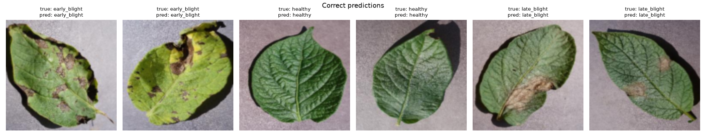

# Plant Disease Classification with a CNN

A small convolutional neural network, built from scratch in PyTorch, that classifies potato leaf images into three classes:

- `healthy`
- `early_blight`
- `late_blight`

This is an end-to-end learning project covering data preparation, model design, training, evaluation, and inference. The network is deliberately simple: three convolutional blocks instead of a pretrained model such as ResNet, so every layer and tensor shape can be followed and understood.

## Results

On the held-out test set (69 images the model never saw during training or model selection):

**Test accuracy: 95.7% (66/69)**

| Class        | Precision | Recall | F1-score |
|--------------|-----------|--------|----------|
| early_blight | 1.000     | 1.000  | 1.000    |
| healthy      | 0.885     | 1.000  | 0.939    |
| late_blight  | 1.000     | 0.870  | 0.930    |


All three errors are the same mistake: **`late_blight` leaves predicted as `healthy`**. These leaves are mostly green, with one or two small lesions, which suggests early-stage infection. The model appears to rely heavily on the overall amount of green versus brown, and it struggles when the lesions are small.


Correct predictions, two per class:



## Dataset

A small, balanced sample of the [PlantVillage dataset](https://github.com/spMohanty/PlantVillage-Dataset) (color images, 256×256):

| Class        | Source folder           | Images |
|--------------|-------------------------|--------|
| healthy      | `Potato___healthy`      | 150    |
| early_blight | `Potato___Early_blight` | 150    |
| late_blight  | `Potato___Late_blight`  | 150    |

Each class is split separately into 70% train, 15% validation, and 15% test (105 / 22 / 23 images per class). The split uses a fixed random seed, so it is reproducible.

## Model

```
Input: 3 × 128 × 128
Conv(3→16)  + BatchNorm + ReLU + MaxPool  →  16 × 64 × 64
Conv(16→32) + BatchNorm + ReLU + MaxPool  →  32 × 32 × 32
Conv(32→64) + BatchNorm + ReLU + MaxPool  →  64 × 16 × 16
Flatten → Linear(16384 → 128) + ReLU + Dropout(0.3)
Linear(128 → 3)
```

Training setup:

- Loss: `CrossEntropyLoss`
- Optimizer: Adam, learning rate 1e-3
- 15 epochs, batch size 32
- Augmentation (training set only): random horizontal flip and random rotation of up to 15°
- The checkpoint with the best validation accuracy is kept. In the reported run that was epoch 9, with 98.5% validation accuracy.

Training is not seeded, so a new run will produce slightly different numbers.

## Project structure

```
├── scripts/
│   ├── download_data.py   # download the PlantVillage sample into data/raw/
│   └── split_data.py      # split data/raw/ into data/train, data/val, data/test
├── dataset.py             # transforms and DataLoaders
├── model.py               # CNN architecture
├── train.py               # training loop, saves best_model.pth
├── evaluate.py            # test-set metrics and plots, saved to results/
├── predict.py             # predict the class of a single image
├── samples/               # one unseen image per class for quick testing
├── results/               # confusion matrix and example predictions
└── requirements.txt
```

`data/` and `best_model.pth` are not tracked in git. Running the steps below regenerates them.

## How to run

Requires Python 3.11. The commands below are for Windows; on macOS or Linux, activate the environment with `source .venv/bin/activate`.

```bash
python -m venv .venv
.venv\Scripts\activate
pip install -r requirements.txt

python scripts/download_data.py   # about 450 images
python scripts/split_data.py
python train.py                   # a few minutes on CPU
python evaluate.py
python predict.py samples/late_blight.jpg
```

Example output of `predict.py`:

```
image: late_blight.jpg
prediction: late_blight (58.1% confidence)

  late_blight    58.1%
  healthy        41.8%
  early_blight   0.1%
```

This sample is an early-stage `late_blight` leaf with a single small lesion. It is classified correctly, but with low confidence. That matches the error pattern seen on the test set.

## Limitations

- **Small dataset.** There are only 105 training images per class, and the test set has 69 images, so each test image changes accuracy by about 1.5 percentage points.
- **Lab conditions.** All PlantVillage images have a plain background and controlled lighting. Performance on real field photos (soil, other leaves, shadows) is expected to be noticeably worse because of domain shift.
- **Early-stage late blight.** Leaves with small lesions are the weakest case, and this is also the costliest mistake: a sick plant labeled as healthy.

## Possible improvements

- Train on more images, including more early-stage `late_blight` examples.
- Use a higher input resolution (for example 224×224) to keep small lesion details.
- Use transfer learning from a pretrained backbone (for example ResNet18) and compare it against this baseline.
- Flag low-confidence predictions (for example below 80%) for manual review instead of returning a hard label.
